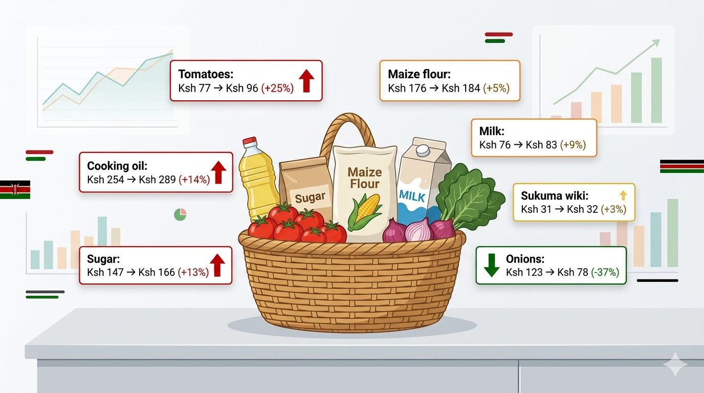
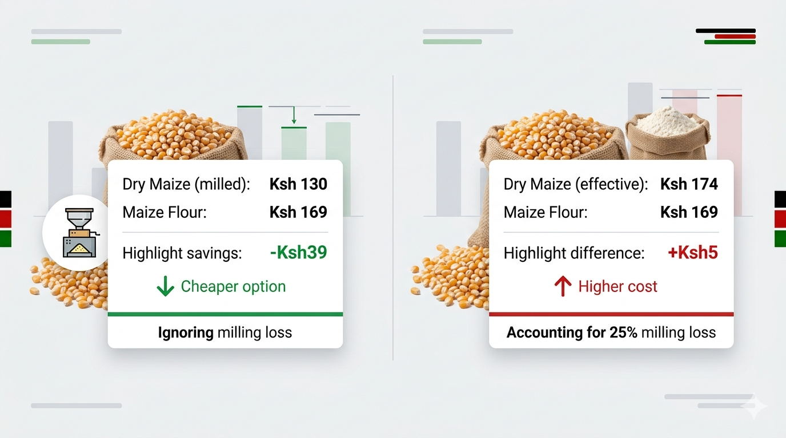
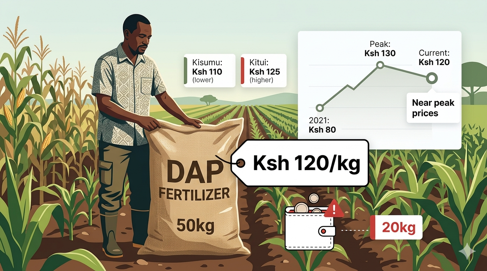
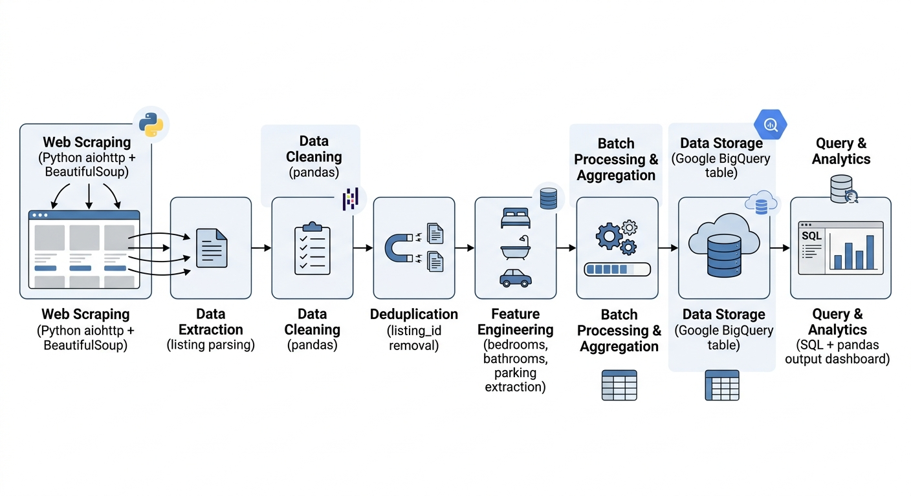
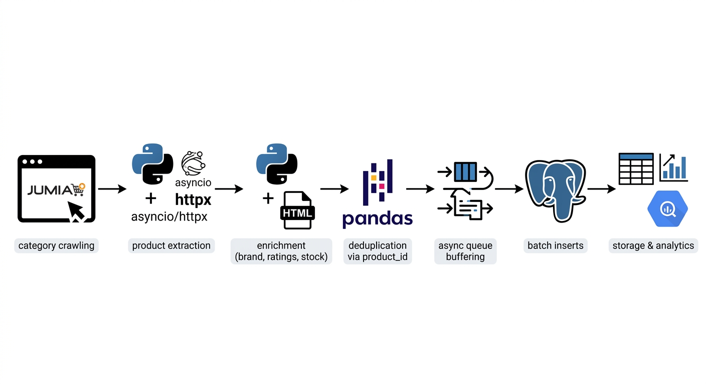

# Portfolio
---
<h2 style="margin-bottom: 0;">Market Insights</h2>

  Analyzing price trends and market dynamics using real-world datasets

### How the cost of food has changed in Kenya

The problem is simple: families are struggling with rising food costs, and it’s not always clear which items are driving that squeeze. To answer this, I leveraged market price data from the World Food Programme Price Database and built an ‘essentials basket’ — maize flour, sugar, cooking oil, milk, sukuma wiki, tomatoes, and onions — the foods most households actually rely on every day.

---
### How Can Families Cut Maize Flour Costs?

Maize is a staple food in Kenya, forming the foundation of daily meals for millions of households. For many families, the choice between buying dry maize and milling it locally or purchasing already processed maize flour is an important economic decision. While conventional wisdom suggests that milling your own maize is cheaper, market conditions, milling costs, and grain-to-flour conversion yields may alter the actual cost advantage.

---
### Can Kenyan Maize Farmers Afford DAP Fertilizer This Season?

Diammonium Phosphate (DAP) is the go-to fertilizer at planting. Farmers trust it because it consistently delivers higher yields. But while households across the country are paying more for essentials like maize flour and cooking oil, the uncertainity is whether fertilizer prices are also climbing. If they are, farmers face a tough choice - stretch already thin budgets, scale back on fertilizer, or turn to alternatives like locally available manure from subsitence farming.

---

<h2 style="margin-bottom: 0;">Data Pipelines</h2>

  Building reliable data flows for tracking prices, listings, and consumer behavior

### Tracking Price Trends Across Markets

>Market price data is only useful if it’s consistent and up to date. To solve this, I set up an automated pipeline that continuously collects, processes, and stores agricultural market data in BigQuery. With over 17,000 scheduled runs, the system provides a reliable foundation for tracking price trends across regions over time.

 

 

---
### Tracking Housing Prices Across Kenyan Cities

Understanding Kenya’s housing market requires consistent and structured data, which is not always readily available. To address this, I built a scheduled scraping pipeline using Kaggle notebooks to collect property listings from Property24 across Nairobi and Mombasa, enabling analysis of pricing patterns and location-based differences in the market.

 

 

---
<h3 style="margin-bottom: 4px;">
  Tracking Product Prices and Customer Sentiment
</h3>

E-commerce data changes quickly, but tracking those changes over time is not straightforward. To solve this, I developed an asynchronous scraping pipeline that collects product data from Jumia at scale, storing it in PostgreSQL with logic to capture only meaningful updates in prices, discounts, and availability. To better understand customer behavior, I extended the pipeline to also collect product reviews — including ratings, text, and timestamps — making it possible to connect pricing decisions with customer feedback and sentiment over time.

  

---

<h2 style="margin-bottom: 0;">Writing</h2>

  Turning data analysis into clear, actionable stories

Besides building data projects, I enjoy writing data stories that explain real-world trends using data. Through these articles I explore topics like food prices, agriculture, household costs, and market trends in Kenya, translating data analysis into insights that anyone can understand.

 

- [What are Kenyans searching — and actually watching — online?](https://medium.com/@adrianjuliusaluoch/what-are-kenyans-searching-and-actually-watching-online-36f3f16ce13c)
- [How I Analyzed Armed Conflicts Using an End-to-End Data Pipeline](https://medium.com/@adrianjuliusaluoch/part-1-setting-the-stage-introducing-the-data-and-objectives-0840c54f0c66)

---

© 2026 Adrian Julius Aluoch. Powered by Jekyll and the Minimal Theme.

